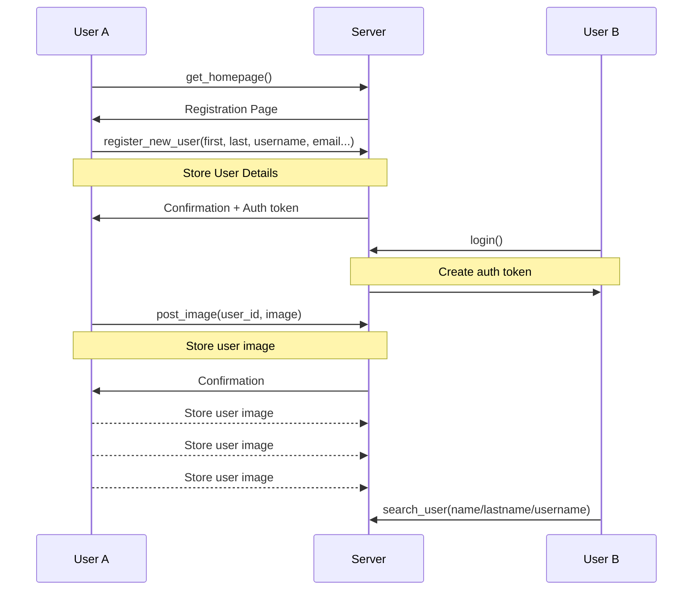

# Test mermaid

```mermaid
sequenceDiagram
    participant A as User A
    participant S as Server
    participant B as User B
    A ->> S: get_homepage()
    S ->> A: Registration Page
    A ->> S: register_new_user(first, last, username, email...)
    Note over A,S: Store User Details
    S ->> A: Confirmation + Auth token
    B ->> S: login()
    Note over B,S: Create auth token
    S ->> B: 
    A ->> S: post_image(user_id, image)
    Note over A,S: Store user image
    S ->> A: Confirmation
    A -->> S: Store user image
    A -->> S: Store user image
    A -->> S: Store user image
    B ->> S: search_user(name/lastname/username)

```
